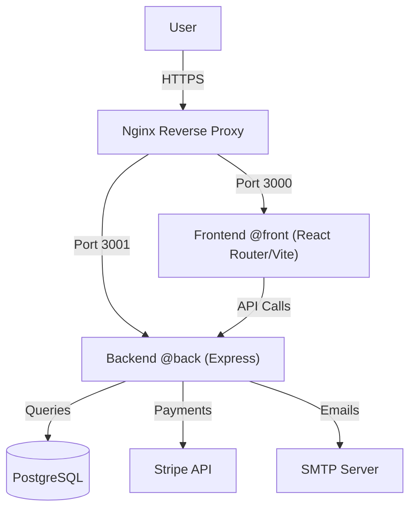

# GreenRoots

## Architecture



# CI/CD & Testing

## Workflows

- **PR Checks**: Runs linting, type-checking, and unit tests on every Pull Request.
- **E2E Tests**: Runs Playwright end-to-end tests nightly and on `master` pushes.
- **Release**: Automates versioning and release notes creation on `master` pushes.
- **Deploy**: Deploys to the production VPS on `master` pushes.

## Running Tests Locally

### Backend

```bash
cd @back
npm test                # Run unit/integration tests
```

### Frontend

```bash
cd @front
npm run test:unit       # Run unit tests (Windows)
npm run test:e2e        # Run e2e tests
```

# Docker Commands

This project uses Docker Compose with different configurations for development and production environments.

## Development Environment

### Main Commands

```bash
npm run dev                    # Start application in development mode
npm run dev:build             # Start application and rebuild images
npm run dev:build:fresh       # Rebuild completely (no cache) and start
npm run dev:down              # Stop all development services
npm run dev:logs              # Show real-time logs
```

## Production Environment

### Main Commands

```bash
npm run prod                  # Start application in production mode
npm run prod:build           # Start application and rebuild images
npm run prod:build:fresh     # Rebuild completely (no cache) and start
npm run prod:down            # Stop all production services
```

## Docker Management

### Cleanup and Maintenance

```bash
npm run docker:clean         # Stop and remove containers, volumes, and networks
npm run docker:reset         # Complete cleanup + remove unused images
npm run docker:rebuild       # Stop and rebuild all images without cache
```

## Individual Services

### Backend

```bash
npm run backend              # Start only backend and database
npm run backend:fresh        # Rebuild and start backend with database
```

### Frontend

```bash
npm run frontend             # Start only frontend
npm run frontend:fresh       # Rebuild and start frontend
```

### Database

```bash
npm run database             # Start only database
```

## Service Logs

### Viewing Logs

```bash
npm run logs:backend         # Show real-time backend logs
npm run logs:frontend        # Show real-time frontend logs
npm run logs:database        # Show real-time database logs
```

## Container Access

### Interactive Shell

```bash
npm run shell:backend        # Open shell in backend container
npm run shell:frontend       # Open shell in frontend container
npm run shell:database       # Open shell in database container
```

## Docker Compose File Structure

The project uses a multi-file approach:

- `docker-compose.yml`: Shared base configuration
- `docker-compose.dev.yml`: Overrides for development
- `docker-compose.prod.yml`: Overrides for production

Commands automatically combine these files based on the targeted environment.
