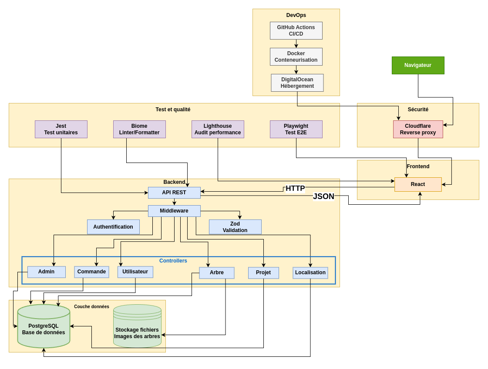
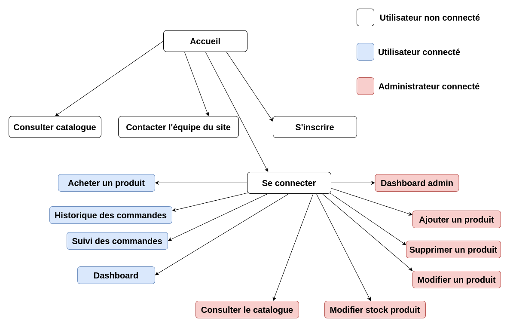
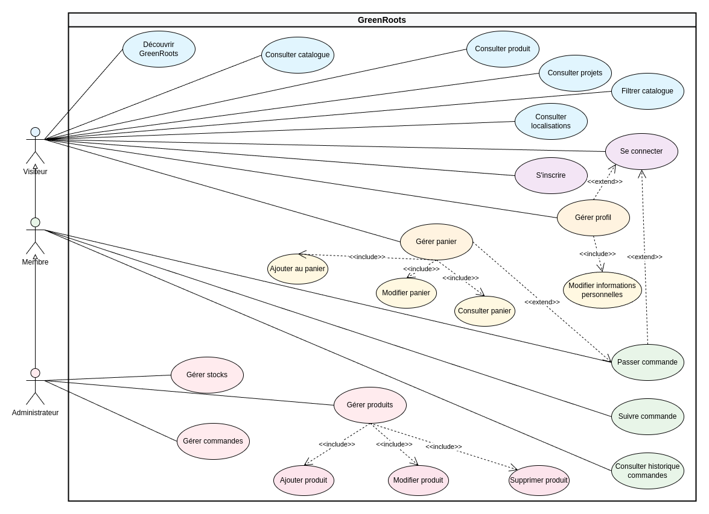

# Cahier des charges du projet GreenRoots 🌳

## Sommaire

1. [Présentation du projet](#présentation-du-projet)
2. [Définition des besoins et des objectifs](#définition-des-besoins-et-des-objectifs)
   - [Besoin](#besoin)
   - [Objectifs](#objectifs)
3. [Les spécifications fonctionnelles](#les-spécifications-fonctionnelles)
   - [MVP (Minimum Viable Product)](#mvp-minimum-viable-product)
   - [Évolutions possibles (Post-MVP)](#évolutions-possibles-post-mvp)
4. [Architecture du projet](#architecture-du-projet)
5. [Liste des technologies et outils utilisés](#liste-des-technologies-et-outils-utilisés)
6. [Public cible](#public-cible)
7. [Navigateurs compatibles et versions](#navigateurs-compatibles-et-versions-au-30-juillet-2025)
   - [Google Chrome](#google-chrome)
   - [Mozilla Firefox](#mozilla-firefox)
   - [Microsoft Edge](#microsoft-edge)
   - [Apple Safari](#apple-safari)
8. [Arborescence et routes](#arborescence-et-routes)
   - [Arborescence (MVP)](#arborescence-mvp)
   - [Routes pour l'API](#routes-pour-lapi)
9. [Liste des User Stories](#liste-des-user-stories)
   - [Visiteur](#visiteur)
   - [Membre](#membre)
   - [Administrateur](#administrateur)
10. [Use cases](#use-cases)
11. [Analyse des risques](#analyse-des-risques)
    - [Phase de conception](#phase-de-conception)
    - [Phase de développement](#phase-de-développement)
    - [Phase de tests](#phase-de-tests)
    - [Phase de déploiement](#phase-de-déploiement)
12. [Équipe projet - Répartition des rôles](#équipe-projet---répartition-des-rôles)
    - [Rôles et responsables](#rôles-et-responsables)

## Présentation du projet:
Plateforme e-commerce dédiée à la vente d'arbres dans le cadre de projets de reforestation. Ces projets correspondront à des zones de plantation. Les utilisateurs pourront donc contribuer à ces projets en achetant des arbres qui seront plantés par Greenroots.

## Définition des besoins et des objectifs

### Besoin

Participer à la reforestation par l’achat d’arbres dans des écosystèmes adaptés.
Solution : GreenRoots a les terrains et les arbres à disposition.

### Objectifs
Permettre aux utilisateurs de découvrir l’entreprise GreenRoots, et de choisir - via un catalogue - les projets de reforestation auxquels ils veulent participer en y contribuant financièrement.

## Les spécifications fonctionnelles

### MVP (Minimum Viable Product)

#### Côté client

##### Présentation et découverte
- Informer les visiteurs sur la mission et la raison d'être de GreenRoots
- Présentation de l'impact environnemental et social du projet

##### Catalogue et achat
- Consulter le catalogue complet des arbres disponibles
- Consulter une fiche arbre détaillée (espèce, origine, impact, prix)
- Acheter des arbres au détail (unité par unité)
- Acheter des arbres en masse avec système de bundles/lots
- Bénéficier de ristournes progressives (ex: 10 arbres = -5%, 50 arbres = -15%)
- Panier d'achat avec calcul automatique des remises

##### Gestion de compte

- Création de compte utilisateur avec validation email
- Connexion et déconnexion sécurisées
- Historique des commandes
- Suivi des commandes

##### Support
- Contacter l’équipe du site par mail

#### Côté GreenRoots (admin)

##### Gestion du catalogue
- Création de nouvelles fiches arbres (espèce, description, photos, prix)
- Édition des informations produits existants
- Suppression d'arbres du catalogue (gestion des stocks)
- Gestion des localisations et filtres de recherche
- Configuration des bundles et systèmes de remises

#### Évolutions possibles (Post-MVP)

##### Gestion avancée des utilisateurs
- Panel administrateur pour la gestion des comptes utilisateurs
- Système de rôles et permissions (admin, modérateur, client)
- Analyse du comportement utilisateur et statistiques d'engagement

##### Traçabilité et suivi environnemental
- Carte interactive de localisation des arbres achetés avec géolocalisation précise
- Suivi photographique de l'évolution des arbres via uploads réguliers
- Système de notifications pour les mises à jour de croissance
- Certificats numériques de plantation avec données de géolocalisation

##### Fonctionnalités avancées
- Version multilingue avec support anglais complet
- Système de gamification :
  - Achievements pour les plantations (badges écologiques)
  - Programme de fidélité avec points de récompense
  - Classements communautaires des plus gros contributeurs

## Architecture du projet
Nous avons opté pour une architecture client-serveur avec une API et une SPA (Single Page Application), afin d’adapter le développement à la taille du projet et de l’équipe,
tout en respectant les principes d’éco-conception et en assurant de hautes performances.
Cette approche privilégie la simplicité et l’efficacité.
Par ailleurs, l’implémentation d’une API REST facilite la gestion des opérations CRUD de manière standardisée.
La sécurisation des données sera assurée grâce à un middleware intégré à l’application, garantissant un contrôle d’accès et une protection cohérente des données.

## Liste des technologies et outils utilisés

| **Technologie** | **Type** | **Justification** |
|---|---|---|
| Postgresql | Base de données | Création et gestion de la base de données SQL, structure de données adaptée à un e-shop |
| Express | Framework | Framework Node.js, rapide et flexible pour la création d'API REST. |
| React | Librairie | Dynamisation de l'interface utilisateur, utilisation d'un virtual DOM (amélioration des performances) et de composants réutilisables |
| React Router | Librairie | Front: rooting, SEO |
| JS (TS) | Langage | Typage fort: lisibilité et maintenabilité du code, accès à l'auto complétion (aide au code) |
| CSS | Langage | Intégration front: ajout de styles |
| HTML | Langage | Intégration front: langage standard du web, utilisation des balises sémantiques |
| Argon2 | Libraire | Hachage des mots de passe, recommandé par OWASP. |
| Zustand | Librairie | Gestionnaire d'état pour React. Alternative à Redux avec moins de boilerplate. |
| Helmet | Librairie | Middleware qui sécurise les en-têtes HTTP. Comble les failles XSS. |
| Zod | Librairie | Bibliothèque de validation de schéma TypeScript-first. Validation robuste des données |
| Jest | Librairie | Framework de tests unitaires JavaScript avec mocking intégré. Exécution rapide des tests. |
| Playwright | Librairie | Outil de tests end-to-end (E2E). Automatisation des scénarios utilisateur complexes et validation de l'expérience complète. |
| Insomnia | Outil | Client REST pour tester les endpoints de l'API |
| CORS | Librairie | Sécurisation des accès API par domaines autorisés, prévention des attaques CSRF. |
| Pg | Librairie | Client Node pour se connecter à la base de données PostgreSQL |
| Biome | Librairie | Linter et formateur de code rapide. Contrôle qualité du code |
| dotenv | Librairie | Gestion sécurisée des variables d'environnement |
| Cloudflare | Proxy / Reverse Proxy | Service de reverse proxy. Amélioration des performances, sécurité DDoS et optimisation de la livraison de contenu. |
| Lighthouse | Outil | Audit des critères de performances, d'accessibilité et de SEO |
| Vite | Outil | Démarrage rapide, configuration simple, optimisation du build |
| Figma | Outil | Plateforme collaborative de création de maquettes UI/UX. Prototypage interactif pour valider l'expérience utilisateur. |
| Draw.io | Outil | Création de wireframes et diagrammes d'architecture |
| Mermaid | Outil | Génération de diagrammes à partir de code. |
| Claude | Outil | Débogage et documentation |
| Github | Outil | Versioning et travail collaboratif |
| Docker | Outil | Déploiement et conteneurisation: facilite le travail collaboratif et la portabilité du code |
| Node 22 | Environnement d'exécution | Environnement d'exécution JavaScript côté serveur. À date, la version LTS est la 22.17.1 |
| VSC | Outil | Éditeur de code |
| Webstorm | Outil | IDE JetBrains |
| Github Actions | CI/CD | Déploiement |
| DigitalOcean | Hébergeur | Déploiement |

## Public cible
Public éco-conscient, entreprises responsables, associations engagées, etc.

## Navigateurs compatibles et versions (au 30 juillet 2025)

### Google Chrome
- Version actuelle : Chrome 138

### Mozilla Firefox

- Version actuelle : Firefox 141

### Microsoft Edge
- Version actuelle : Edge 138

### Apple Safari
- Version actuelle : Safari 18.6

## Arborescence et routes

### Arborescence (MVP)

### Routes pour l’API

#### Produits & Catalogue

| **Méthode** | **Endpoint** | **Description** |
|---|---|---|
| **GET** | `/api/trees` | Lister tous les arbres (catalogue) |
| **GET** | `/api/trees/:id` | Détails d'un arbre |
| **POST** | `/api/trees` | Ajouter un arbre |
| **PUT** | `/api/trees/:id` | Modifier les infos d'un arbre |
| **DELETE** | `/api/trees/:id` | Supprimer un arbre |

#### Localisations

| **Méthode** | **Endpoint** | **Description** |
|---|---|---|
| **GET** | `/api/locations` | Lister toutes les localisations |
| **GET** | `/api/locations/:id` | Détails d'une localisation |
| **POST** | `/api/locations/` | Ajouter une localisation |
| **PUT** | `/api/locations/:id` | Modifier les infos d'une localisation |
| **DELETE** | `/api/locations/:id` | Supprimer une localisation |

#### Projets

| **Méthode** | **Endpoint** | **Description** |
|---|---|---|
| **GET** | `/api/projects` | Lister tous les projets |
| **GET** | `/api/projects/:id` | Détails d'un projet |
| **POST** | `/api/projects` | Ajouter un projet |
| **PUT** | `/api/projects/:id` | Modifier les infos d'un projet |
| **DELETE** | `/api/projects/:id` | Supprimer un projet |

#### Authentification

| **Méthode** | **Endpoint** | **Description** |
|---|---|---|
| **POST** | `/api/auth/register` | Inscription utilisateur |
| **POST** | `/api/auth/login` | Connexion utilisateur |
| **POST** | `/api/auth/logout` | Déconnexion utilisateur |

#### Panier

| **Méthode** | **Endpoint** | **Description** |
|---|---|---|
| **GET** | `/api/cart` | Récupérer le contenu du panier (pour utilisateur connecté) |
| **POST** | `/api/cart` | Ajouter un produit au panier |
| **PUT** | `/api/cart/:itemId` | Modifier la quantité d'un produit dans le panier |
| **DELETE** | `/api/cart/:itemId` | Retirer un produit du panier |

#### Commande

| **Méthode** | **Endpoint** | **Description** |
|---|---|---|
| **POST** | `/api/orders` | Créer une nouvelle commande |
| **GET** | `/api/orders` | historique des commandes |
| **GET** | `/api/orders/:id` | Détails d'une commande |

## Liste des User Stories
*Visiteur* : utilisateur non inscrit

*Membre* : utilisateur inscrit

*Administrateur* : utilisateur inscrit ayant le rôle administrateur

Le *visiteur* est l’utilisateur ayant *le moins de droits*.
L’*administrateur* est l’utilisateur ayant *le plus de droits*.

Ce qui est possible pour un *visiteur*, l’est pour un *membre* et un *administrateur*.
Ce qui est possible pour un *membre*, l’est pour un *administrateur*.

### Visiteur

| **ID** | **En tant que** | **Je veux** | **Afin de** | **Sprint** |
|---|---|---|---|---|
| US001 | Visiteur | accéder à la landing page | découvrir GreenRoots | 1 |
| US002 | Visiteur | consulter le catalogue des produits | voir les produits proposés | 1 |
| US003 | Visiteur | consulter un produit individuel | connaître les détails du produit | 1 |
| US004 | Visiteur | consulter la localisation des arbres | voir les produits proposés par localisation | 1 |
| US005 | Visiteur | consulter les projets | voir les projets proposés | 1 |
| US006 | Visiteur | ajouter un ou plusieurs produits au panier | préparer ma commande | 2 |
| US007 | Visiteur | consulter mon panier | supprimer / modifier / valider mon panier | 2 |
| US008 | Visiteur | filtrer le catalogue sur certains critères | affiner ma recherche | 2 |
| US009 | Visiteur | contacter l'équipe du site par mail | transmettre ou demander une information | 1 |
| US010 | Visiteur | naviguer sur le site au clavier | afin de s'adapter aux personnes handicapées | 2 |
| US011 | Visiteur | suivre le site avec des outils d'accessibilité | afin de s'adapter aux personnes handicapées | 2 |
| US012 | Visiteur | m'inscrire sur le site | bénéficier des avantages membre | 2 |

### Membre

| **ID** | **En tant que** | **Je veux** | **Afin de** | **Sprint** |
|---|---|---|---|---|
| US013 | Membre | me connecter au site | interagir avec mon espace personnel | 2 |
| US014 | Membre | réinitialiser mon mot de passe | me connecter | 2 |
| US015 | Membre | supprimer mon compte | ne plus avoir de compte | 2 |
| US016 | Membre | consulter l'historique de mes commandes | consulter l'ensemble des commandes passées | 2 |
| US017 | Membre | modifier mes informations personnelles | choisir les informations disponibles | 2 |
| US018 | Membre | consulter le statut d'une de mes commandes | suivre mes commandes en cours | 2 |

### Administrateur

| **ID** | **En tant que** | **Je veux** | **Afin de** | **Sprint** |
|---|---|---|---|---|
| US019 | Administrateur | ajouter un produit | rendre le produit disponible pour les utilisateurs | 3 |
| US020 | Administrateur | modifier un produit | modifier les informations du produit | 2 |
| US021 | Administrateur | supprimer un produit | supprimer un produit | 2 |
| US022 | Administrateur | ajouter une quantité de produit | l'utilisateur puisse ajuster sa commande | 2 |
| US023 | Administrateur | consulter les stocks de produits | suivre l'état des stocks | 2 |
| US024 | Administrateur | consulter le statut des commandes | suivre son statut | 3 |
| US025 | Administrateur | modifier le statut d'une commande | mettre à jour son statut | 3 |

## Use cases

## Analyse des risques

### Phase de conception

| **Risque** | **Description** | **Mesures préventives** |
|---|---|---|
| Mauvaise compréhension des besoins | L'application ne répond pas aux attentes du client ou des utilisateurs | - Cahier des charges - Prototypes ou wireframes |
| Choix techniques inadaptés | Stack technique inappropriée au projet | - Liste des technologies utilisées et vérification de leurs compatibilités |

### Phase de développement

| **Risque** | **Description** | **Mesures préventives** |
|---|---|---|
| Bugs critiques ou régressions | Erreurs techniques qui empêchent le fonctionnement | - Tests unitaires et fonctionnels - Intégration continue (CI) |
| Problèmes d'intégration | Incompatibilités entre modules ou avec l'API | - Tests d'intégration réguliers |
| Mauvaise qualité du code | Difficultés de maintenance ou d'évolutivité | - Revue de code - Conventions de développement - Utilisation de Biome et TypeScript |
| Incompatibilité navigateur / mobile | Affichage incorrect selon les appareils | - Responsive design - Tests multi-navigateurs |

### Phase de tests

| **Risque** | **Description** | **Mesures préventives** |
|---|---|---|
| Tests insuffisants | Bugs non détectés avant mise en production | - Plan de tests |
| Non-conformité fonctionnelle | Fonctions qui ne répondent pas aux attentes | - Validation avec maquettes interactives - Démo de sprint |

### Phase de déploiement

| **Risque** | **Description** | **Mesures préventives** |
|---|---|---|
| Erreur lors du déploiement | Application indisponible ou non fonctionnelle | - Procédure de déploiement automatisée - Utilisation de Docker |
| Problèmes de configuration | Variables d'environnement mal gérées | - Utilisation de fichiers .env |

## Équipe projet - Répartition des rôles

### Rôles et responsables
| **Rôle** | **Responsable(s)** |
|---|---|
| Chef de projet | Chloé |
| Développeur | Chloé, Vincent, Johan, Adam, Cédric |
| UX / UI | Chloé, Vincent, Johan, Adam, Cédric |
| DevOps | Cédric |
| Testeur | Adam |
| Responsable qualité | Cédric / Adam |
